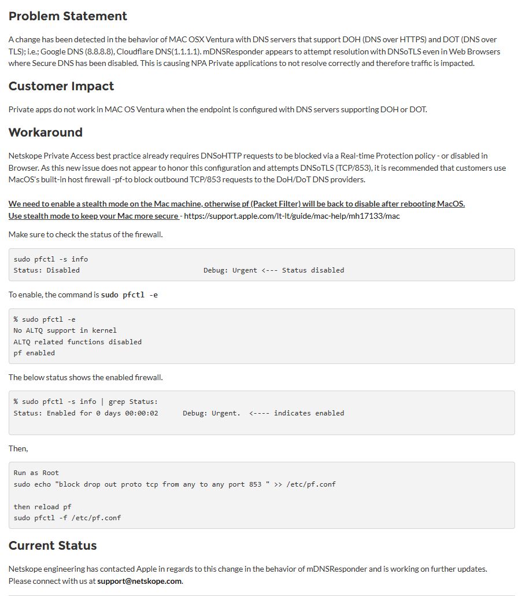

# Fix your ADB when using Netskope

Project used to setup your MacOS in order to use Netskope and fix the ADB freezes when connecting / disconnecting from your VPN.

## Step 1 : Execute the script

``` bash
chmod +x script.sh
sudo ./script.sh
```

## Step 2 : Disable the private VPN Access of your emulator  

``` bash
adb shell settings put global private_dns_mode off
```

Documentation used to create this script : 
